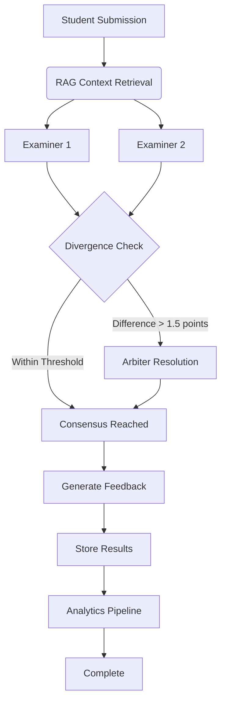

# 🎓 AI Grading System (Multi-Agent)


An intelligent, multi-agent system that automates grading of complex academic essay questions with human-level reasoning and detailed pedagogical feedback. Built as a Capstone Project in Computer Science Engineering.

**Key Capabilities:**
- 🤖 **Multi-Agent Architecture** with consensus-based grading  
- 📊 **Batch Processing** optimized for high throughput
- 🎯 **Pedagogical Feedback** explaining grading decisions
- 🔐 **Enterprise-Ready** with error handling and resilience

---

## 🧠 System Architecture

The grading system employs a **distributed, consensus-based architecture** orchestrated through **LangGraph** and optimized using **DSPy** for intelligent prompt engineering.

### Agent Components

| Agent | Role | Description |
|-------|------|-------------|
| **Examiner C1** | Primary Evaluator | Grades submissions independently against rubric using RAG |
| **Examiner C2** | Secondary Evaluator | Independent evaluation for consensus validation |
| **Arbiter** | Dispute Resolution | Activated when divergence exceeds threshold; mediates final grade |
| **Analytics Engine** | Quality Assurance | Detects plagiarism, tracks student progress, provides insights |

### Processing Workflow



## ✨ Key Features

- **🚀 Parallel Batch Processing** – Handles high-volume submissions without hitting LLM rate limits (async workers + chunking strategy)
- **💡 Intelligent Cost Optimization** – Tiered model strategy (Gemini 2.0 Flash for routine grading, Pro for complex arbitration)
- **🛡️ Production-Grade Resilience** – Self-healing logic with retry mechanisms, graceful API error handling, and JSON validation
- **📝 Context-Aware Feedback** – Pedagogical explanations that help students understand grading rationale
- **🔍 Academic Integrity Checks** – Semantic similarity detection across submissions
- **📈 Student Progress Analytics** – Tracks performance trends and learning patterns
- **🗄️ Postgres + Alembic** – Versioned database migrations for reproducible deployments

## 🛠️ Technology Stack

| Layer | Technology | Purpose |
|-------|-----------|---------|
| **Orchestration** | LangGraph | Multi-agent workflow engine |
| **Prompt Engineering** | DSPy (Stanford) | Structured prompt optimization |
| **LLM Provider** | Google Gemini 2.0 Flash/Pro | Core AI reasoning |
| **LLM Interface** | LiteLLM | Unified LLM abstraction |
| **Backend API** | FastAPI | REST endpoints |
| **Database** | PostgreSQL 16 | Persistent data storage |
| **Migrations** | Alembic | Schema versioning |
| **Vector Search** | ChromaDB | RAG context retrieval |
| **Frontend** | React + TypeScript + Tailwind | User interface |
| **Containerization** | Docker & Docker Compose | Local & cloud deployment |

## 📦 Installation & Setup

### Prerequisites

Ensure you have the following installed:

- **Docker** (v20.0+) and **Docker Compose** (v2.0+)
- **Git** (for version control)
- **Python** (v3.12+) – *only if running locally without Docker*

### Clone the Repository

```bash
git clone https://github.com/savinoo/ai-grading-system.git
cd ai-grading-system
```

### Environment Variables

Environment configuration templates are provided as `.env.example` files in each directory. Follow these steps:

#### 1. **Root Directory**
```bash
cp .env.example .env
```
The root `.env` contains shared Docker Compose settings (PostgreSQL credentials).

#### 2. **Backend**
```bash
cp backend/.env.example backend/.env
```
Then edit `backend/.env` and set:
- `DATABASE_URL` – PostgreSQL connection string (matches root `.env`)
- `GOOGLE_API_KEY` – Your Google Gemini API key (get from [Google AI Studio](https://aistudio.google.com/apikey))
- `SECRET_KEY` – Random string for JWT signing (generate via `python -c "import secrets; print(secrets.token_urlsafe(32))"`)
- `BREVO_API_KEY` – Email service key (optional, for notifications)
- Other settings as needed (see detailed comments in `.env.example`)

#### 3. **Frontend**
```bash
cp frontend/.env.example frontend/.env
```
Then edit `frontend/.env` and set:
- `VITE_API_BASE_URL` – Should match your backend URL (default: `http://localhost:8000`)

**For reference:** Each directory's `.env.example` file contains all available configuration options with explanatory comments.

### Setup with Docker (Recommended)

This is the **fastest and most reliable** approach.

#### 1. Start All Services

```bash
cd ai-grading-system
docker compose up -d
```

This will spin up:
- **Backend** (FastAPI on `http://localhost:8000`)
- **Frontend** (React on `http://localhost:5173`)
- **PostgreSQL** (on `localhost:5432`)

#### 2. Run Database Migrations

```bash
docker compose exec backend alembic upgrade head
```

This applies all migrations in sequence:
1. Database infrastructure (extensions, functions)
2. Core schema (tables for users, exams, grading criteria, etc.)
3. Triggers (auto-update timestamps)
4. Seed data (default grading criteria)

#### 3. Verify the Setup

- **Frontend:** Open [http://localhost:5173](http://localhost:5173)
- **Backend API Docs:** Open [http://localhost:8000/docs](http://localhost:8000/docs) (Swagger UI)
- **Health Check:**
  ```bash
  curl http://localhost:8000/health
  ```

### Local Development (Without Docker)

If you prefer running locally:

#### 1. Backend Setup

```bash
cd backend

# Create virtual environment
python -m venv venv
source venv/bin/activate  # On Windows: venv\Scripts\activate

# Install dependencies
pip install -r requirements.txt

# Run migrations
alembic upgrade head

# Start server
uvicorn src.main.server:app --reload --port 8000
```

#### 2. Frontend Setup

```bash
cd frontend

# Install dependencies
npm ci

# Start development server
npm run dev
```

### Troubleshooting

| Issue | Solution |
|-------|----------|
| **Docker build fails** | Run `docker compose down -v` to remove volumes, then retry |
| **Port 5432 already in use** | Check `docker ps` for conflicting containers or change port in `docker-compose.yml` |
| **Alembic migration fails** | Verify `DATABASE_URL` in `.env`, ensure PostgreSQL is running |
| **Frontend can't reach backend** | Check `VITE_API_URL` in `frontend/.env` matches backend URL |
| **LLM API errors** | Verify `GOOGLE_API_KEY` is valid and has quota available |

---

## 🗄️ Database Migrations Guide

### Creating a New Migration

```bash
# Generate a new migration file
docker compose exec backend alembic revision --autogenerate -m "description of changes"

# Review the generated migration file in backend/alembic/versions/

# Apply the migration
docker compose exec backend alembic upgrade head
```

### Important Migration Rules

⚠️ **Do NOT manually modify:**
- `revision` IDs
- `down_revision` references
- Migration order

✅ **Safe to modify:**
- Migration file names
- SQL logic and table definitions

### Rollback a Migration

```bash
# Revert to previous migration
docker compose exec backend alembic downgrade -1

# Revert to specific revision
docker compose exec backend alembic downgrade <revision_id>
```

## 📊 Available Scripts

### Backend

```bash
# Format code
docker compose exec backend black src/

# Run linting
docker compose exec backend pylint src/

# Run tests
docker compose exec backend pytest tests/

# Shell access
docker compose exec backend bash
```

### Frontend

```bash
# Format & lint
npm run lint

# Build for production
npm run build

# Preview production build
npm run preview
```

## 🚀 Deployment

### Production Checklist

- [ ] Set `ENVIRONMENT=production` in backend `.env`
- [ ] Disable `DEBUG=false`
- [ ] Use production LLM keys
- [ ] Configure proper `CORS_ORIGINS`
- [ ] Set up database backups
- [ ] Enable HTTPS/SSL
- [ ] Review and test all migrations
- [ ] Set resource limits in Docker Compose

---
## 🤝 Contributing

Contributions are welcome! Please:

1. Fork the repository
2. Create a feature branch (`git checkout -b feature/amazing-feature`)
3. Commit changes (`git commit -m 'Add amazing feature'`)
4. Push to branch (`git push origin feature/amazing-feature`)
5. Open a Pull Request


## 📄 License

This project is licensed under the **MIT License** – see [LICENSE](LICENSE) for details.

## 👥 Authors

- [**Lucas Lorenzo Savino**](https://github.com/savinoo)
- [**Maycon Mendes**](https://github.com/Maycon-M)

---

## 🙏 Acknowledgments

- Built with [LangGraph](https://github.com/langchain-ai/langgraph) by LangChain AI
- Prompt optimization powered by [DSPy](https://github.com/stanfordnlp/dspy) from Stanford NLP
- LLM inference via [Google Gemini](https://ai.google.dev/) and [LiteLLM](https://github.com/BerriAI/litellm)

---

**Last Updated:** February 2026 | **Status:** Active Development
