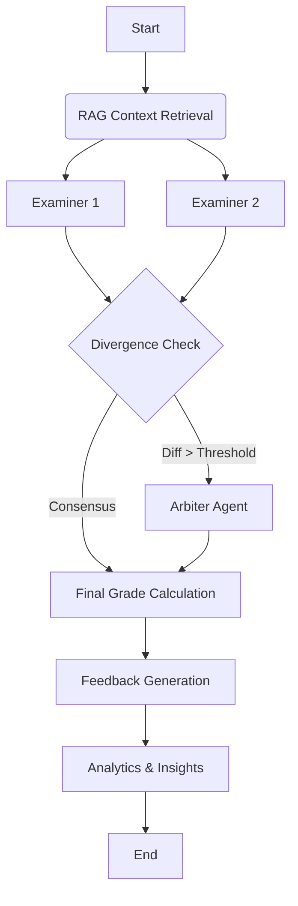

# 🎓 AI Grading System (Multi-Agent)


An autonomous, multi-agent system designed to automate the grading of complex academic essay questions with human-level reasoning and pedagogical feedback. Developed as a Capstone Project (TCC) in Computer Engineering.

**✨ NEW: Professor Assistant Module with Analytics Dashboard!**

## 📊 Results & Impact

**Currently in pilot deployment at Instituto Federal Fluminense (IFF)** with real coursework and students.

- **5x throughput improvement** — Grading 30 submissions reduced from 10+ minutes to ~2 minutes
- **90% reduction in vector DB queries** via intelligent RAG caching
- **Dual-examiner consensus** — 2 independent Grader agents + 1 Referee reduces bias
- **Full explainability** — Every grade includes written justification traceable to rubric criteria
- **10+ analytics visualizations** — Student evolution tracking, plagiarism detection, learning gap identification

---

## 🚀 Quick Deploy

### Option 1: Streamlit Cloud (Recommended - 2 minutes)

[](https://share.streamlit.io/deploy)

1. Click the badge above (or go to https://share.streamlit.io/)
2. Login with GitHub
3. Select:
   - **Repository:** `savinoo/ai-grading-system`
   - **Branch:** `feature/professor-assistant`
   - **Main file:** `app/main.py`
4. Click "Deploy"
5. Add Secrets (Settings > Secrets):
   ```toml
   GOOGLE_API_KEY = "your-gemini-api-key"
   MODEL_NAME = "gemini-2.0-flash"
   TEMPERATURE = "0"
   ```
6. Get Gemini API key (free): https://aistudio.google.com/app/apikey

**Done! Your app will be live at:** `https://[your-app-name].streamlit.app`

### Option 2: Local Development

```bash
git clone https://github.com/savinoo/ai-grading-system.git
cd ai-grading-system
pip install -r requirements.txt

# Create .streamlit/secrets.toml with your API key
streamlit run app/main.py
```

---

## ⚡ Performance & Recent Improvements

**Latest Update (2026-02-10):**

### 🚀 Speed: 5x Faster Grading
- **Before:** 10 students × 3 questions = ~10 minutes
- **After:** 10 students × 3 questions = ~2-3 minutes
- **How:** Increased parallelism (API_CONCURRENCY 2 → 10)

### 🎯 Quality: Production-Grade Reliability
- ✅ **Grade normalization:** Auto-detects and fixes 0-1 vs 0-10 scale issues
- ✅ **Robust error handling:** Graceful fallbacks when LLM returns invalid JSON
- ✅ **Performance logging:** Detailed timing for debugging bottlenecks
- ✅ **RAG caching:** 90% reduction in vector DB queries

### 📚 Documentation
- [`PERFORMANCE.md`](PERFORMANCE.md) - Benchmarks, configuration, troubleshooting
- [`CHANGELOG.md`](CHANGELOG.md) - Detailed changelog with migration guide

### Configuration
For Gemini free-tier (recommended to avoid rate limits):
```bash
export API_CONCURRENCY=5
export API_THROTTLE_SLEEP=0.5
```

For OpenAI (paid tier):
```bash
export API_CONCURRENCY=10  # or higher for more speed
```

See [PERFORMANCE.md](PERFORMANCE.md) for full configuration guide.

---

## 🧠 Core Architecture

This system leverages a **Multi-Agent Workflow** orchestrated by **LangGraph** and optimized with **DSPy** for robust prompt engineering.

### The Agents
1.  **🔍 Examiner Agent (C1 & C2):** Two independent instances that grade student submissions against a detailed rubric using RAG (Retrieval-Augmented Generation) for context.
2.  **⚖️ Arbiter Agent:** Activated only when C1 and C2 diverge significantly (e.g., score difference > 1.5). It reviews arguments from both and decides the final grade.
3.  **🧬 Analytics Engine:** Runs in parallel to detect semantic plagiarism and analyze student evolution trends across submissions.

### Workflow Diagram


---

## 🆕 Professor Assistant Module

**NEW in v2.0!** Advanced analytics and student tracking system.

### Features

#### 👤 Student Profile
- Grade evolution tracking with trend detection
- Learning gap identification (<60% criterion avg)
- Strength recognition (>80% criterion avg)
- Heatmap visualization of criterion performance
- Confidence-scored predictions (R² regression)

#### 🏫 Class Analytics
- Statistical distribution (mean, median, std dev, Q1, Q3, IQR)
- Grade distribution (A/B/C/D/F buckets)
- Outlier detection (struggling students & top performers)
- Common learning gaps across class (>30% affected)
- Question difficulty ranking
- Top 5 student comparison (radar chart)

#### 📊 Visualizations
- 10+ interactive Plotly charts
- Dual-axis comparisons
- Heatmaps with colorscales
- Box plots, violin plots, radar charts
- Responsive design with gradient headers

#### 💾 Persistent Memory
- JSON-based student profile storage
- GDPR-compliant data deletion
- Automatic 365-day retention policy
- Export functionality for reports

**Access:** Sidebar > "📊 Analytics Dashboard"

---

## 🚀 Key Features

*   **Massive Parallel Processing:** Optimized to handle batch corrections without hitting LLM Rate Limits (using Tenacity + Chunking).
*   **Cost-Efficient Intelligence:** Uses a tiered model strategy (Gemini 2.0 Flash for volume, Pro for complex arbitration).
*   **Resilience:** Self-healing logic for API errors and JSON formatting hallucinations.
*   **Pedagogical Feedback:** Generates constructive comments explaining *why* a grade was given.
*   **Student Tracking:** Longitudinal performance analysis with trend detection.
*   **Auto-Tracking:** Analytics automatically capture data during batch corrections.

---

## 🛠️ Tech Stack

*   **Orchestration:** LangGraph
*   **Prompt Optimization:** DSPy (Stanford)
*   **LLM:** Google Gemini 2.0 Flash (via LiteLLM)
*   **Interface:** Streamlit
*   **Vector DB:** ChromaDB (for RAG)
*   **Analytics:** Plotly, NumPy, SciPy
*   **Testing:** Pytest (90%+ coverage on analytics)

---

## 📦 Installation & Setup

### Prerequisites
- Python 3.10+
- Google Gemini API key (free tier available)

### Steps

1.  **Clone the repo:**
    ```bash
    git clone https://github.com/savinoo/ai-grading-system.git
    cd ai-grading-system
    ```

2.  **Install dependencies:**
    ```bash
    pip install -r requirements.txt
    ```

3.  **Configure Environment:**
    Create `.streamlit/secrets.toml`:
    ```toml
    GOOGLE_API_KEY = "your-api-key-here"
    MODEL_NAME = "gemini-2.0-flash"
    TEMPERATURE = "0"
    ```
    
    Get API key: https://aistudio.google.com/app/apikey

4.  **Run the App:**
    ```bash
    streamlit run app/main.py
    ```

5.  **Open Browser:**
    ```
    http://localhost:8502
    ```

---

## 📖 Usage

### Single Student Debug Mode
1. Select "Single Student (Debug)" in sidebar
2. Configure question and rubric
3. Provide student answer
4. Execute and review detailed results

### Batch Processing (Class)
1. Select "Batch Processing (Turma)"
2. Choose "Simulação Completa (IA)"
3. Configure: 5 questions, 5-10 students
4. Generate questions → Simulate answers → Execute corrections
5. View results dashboard with class metrics

### Analytics Dashboard
1. After running batch corrections, select "📊 Analytics Dashboard"
2. Navigate tabs:
   - **Overview:** Total students, submissions, global metrics
   - **Student Profile:** Individual student analysis with visualizations
   - **Class Analysis:** Aggregate statistics and insights

**Note:** Analytics automatically track data during batch corrections. No manual setup needed!

---

## 🧪 Testing

Run tests:
```bash
pytest tests/ -v
```

Test coverage (analytics modules):
```bash
pytest tests/test_analytics.py --cov=src/analytics
```

---

## 📂 Project Structure

```
ai-grading-system/
├── app/
│   ├── main.py              # Streamlit entry point
│   ├── analytics_ui.py      # Analytics visualizations (NEW)
│   └── ui_components.py     # UI helpers
├── src/
│   ├── agents/              # Examiner, Arbiter agents
│   ├── analytics/           # Student tracker, class analyzer (NEW)
│   ├── domain/              # Pydantic schemas
│   ├── memory/              # Persistent storage (NEW)
│   ├── workflow/            # LangGraph workflow
│   ├── rag/                 # Vector DB, retrieval
│   └── config/              # Settings, prompts
├── tests/                   # Unit tests
├── examples/                # Integration examples
├── DEPLOY.md                # Deployment guide
└── requirements.txt         # Dependencies
```

---

## 🎨 Screenshots

### Analytics Dashboard
*(Add screenshots after deployment)*

**Student Profile:**
- Gradient header with performance cards
- Dual chart (line + bar) with trend line
- Heatmap of criterion evolution
- Severity-coded learning gaps

**Class Analytics:**
- Statistical distribution (3-tab view)
- Ranking with medals and trend indicators
- Radar chart comparison (Top 5)
- Question difficulty ranking

---

## 🤝 Contributing

Contributions are welcome! Please:
1. Fork the repository
2. Create a feature branch
3. Make your changes with tests
4. Submit a pull request

---

## 📄 License

MIT License - See LICENSE file for details

---

## 👥 Authors

**Lucas Lorenzo Savino** & **Maycon Mendes**  
Computer Engineering - Instituto Federal Fluminense (IFF)

**Capstone Project (TCC)** - 2024/2025

---

## 🙏 Acknowledgments

- **LangGraph** - Agent orchestration framework
- **DSPy** - Prompt optimization (Stanford)
- **Google Gemini** - LLM API
- **Streamlit** - Interactive web framework
- **OpenClaw** - Development automation

---

## 📞 Support

Issues? Questions?
- Open a GitHub issue
- Contact: github.com/savinoo

---

## 🔗 Links

- **Live Demo:** [Coming soon - Deploy on Streamlit Cloud]
- **Documentation:** See `DEPLOY.md`, `ANALYSIS.md`, `IMPLEMENTATION_SUMMARY.md`
- **GitHub:** https://github.com/savinoo/ai-grading-system

---

**⭐ Star this repo if you find it useful!**
