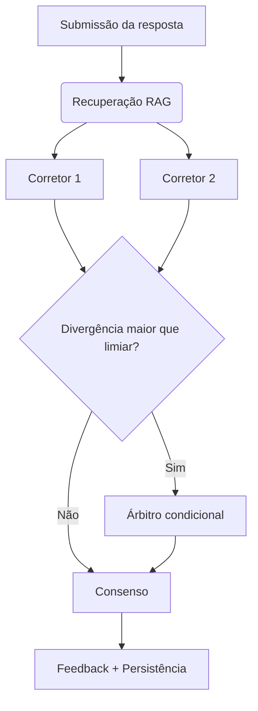

# AI Grading System (Multi-Agent)


Sistema multi-agente para correção automatizada de provas discursivas, com suporte a RAG (Retrieval-Augmented Generation) e arbitragem condicional por divergência. Trabalho de Conclusão de Curso (TCC) submetido ao Bacharelado em Engenharia da Computação no Instituto Federal Fluminense, Campos dos Goytacazes-RJ, em abril de 2026.

**Autores:** Lucas Lorenzo Savino e Maycon Mendes Fernandes
**Orientador:** Prof. Dr. Luiz Gustavo Lourenço Moura
**Banca:** Prof. Dr. Fernando Luiz de Carvalho e Silva, Prof. Me. Márcio de Oliveira Pontes (IFF)

---

## Resumo

A correção de provas discursivas é uma tarefa onerosa, sujeita a alto custo de tempo e subjetividade do avaliador. Este trabalho desenvolve e avalia um sistema de correção automatizada baseado em múltiplos agentes de Inteligência Artificial, com suporte à Recuperação Aumentada por Geração (RAG) e arbitragem condicional por divergência.

**Mecânica do sistema:**

- Dois agentes corretores independentes avaliam cada resposta em paralelo, com base em uma rubrica e no material didático da disciplina
- Quando a divergência entre as notas ultrapassa um limiar configurável, um terceiro agente árbitro é acionado
- Desenho inspirado no processo oficial de correção do ENEM

---

## Resultados validados (resumo do TCC)

A avaliação foi conduzida via estudo de caso controlado com dados pareados entre condições com e sem RAG, três questões discursivas de Algoritmos e Estrutura de Dados e quatro níveis de qualidade de resposta.

- **Completude estrutural:** 100 por cento no fluxo end-to-end. O sistema completou sem falhas.
- **Mecanismo de divergência:** das 24 correções avaliadas, nenhuma ultrapassou o limiar de 2.0 pontos (máximo observado: 1.22). O árbitro condicional não foi acionado durante o experimento.
- **Efeito do RAG na especificidade avaliativa:**
  - Nível intermediário: Δ = +0.84
  - Nível fraco: Δ = +0.12
  - Níveis extremos: Δ = 0.00
- **Estabilidade (teste com R = 3 repetições):**
  - Níveis extremos: variação nula
  - Nível intermediário: critério atendido (≤ 1.0 ponto)
  - Nível fraco: variação máxima de 1.37 (ultrapassou o limiar)

---

## Arquitetura

| Camada | Tecnologia |
|---|---|
| Orquestração de agentes | LangGraph + LangChain |
| Backend API | FastAPI |
| Banco de dados relacional | PostgreSQL |
| Vector store | ChromaDB |

LLM provider e embeddings são configuráveis via variáveis de ambiente.

### Fluxo de correção


```mermaid
graph TD
    A[Submissão da resposta] --> B(Recuperação RAG)
    B --> C1[Corretor 1]
    B --> C2[Corretor 2]
    C1 --> D{Divergência maior que limiar?}
    C2 --> D
    D -->|Sim| E[Árbitro condicional]
    D -->|Não| F[Consenso]
    E --> F
    F --> G[Feedback + Persistência]
```

---

## Instalação

### Pré-requisitos

- Python 3.12 ou superior
- PostgreSQL
- Docker e Docker Compose (opcional, recomendado para reprodutibilidade local)

### Setup com Docker (recomendado)

```bash
git clone https://github.com/savinoo/ai-grading-system.git
cd ai-grading-system

cp database.env.example database.env
cp .env.example .env

docker compose up -d
docker compose exec backend alembic upgrade head
```

A API estará disponível em `http://localhost:8000` e a documentação Swagger em `/docs`.

### Setup local sem Docker

```bash
python -m venv .venv
source .venv/bin/activate
pip install -r requirements.txt
alembic upgrade head
uvicorn src.main.server.server:app --reload --port 8000
```

### Variáveis principais

Configure em `.env`:

- `DATABASE_URL` — conexão PostgreSQL
- `SECRET_KEY` — chave para assinatura JWT
- `EMBEDDING_PROVIDER` — `google`, `openai` ou `local` (Ollama)
- `EMBEDDING_MODEL` — override opcional do modelo de embedding
- Chave de API do LLM provider escolhido

Veja `.env.example` para a lista completa de variáveis.

---

## Limitações e trabalhos futuros

- A avaliação foi conduzida com respostas sintéticas geradas em quatro níveis de qualidade sobre Algoritmos e Estrutura de Dados, não com dados reais de turma em produção
- O nível fraco apresentou variação acima do critério no teste de estabilidade (1.37 acima do limiar de 1.0 ponto)
- O sistema é um protótipo de pesquisa validado em escopo controlado, não um produto pronto para deployment institucional em larga escala

---

## Licença

MIT — ver arquivo `LICENSE`.
