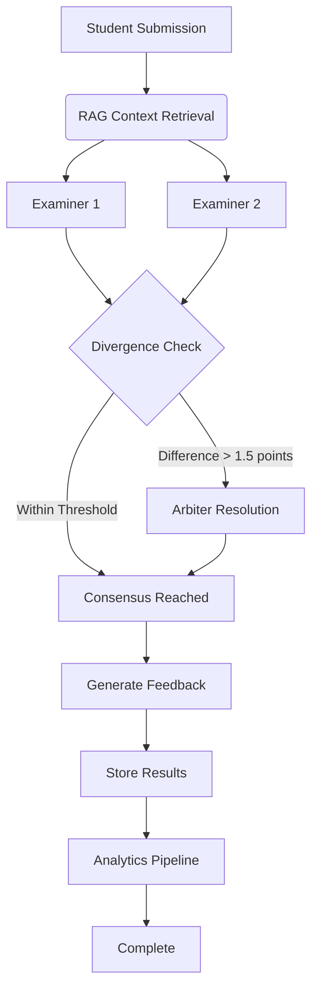

# 🎓 AI Grading System (Multi-Agent)


An intelligent, multi-agent system that automates grading of complex academic essay questions with human-level reasoning and detailed pedagogical feedback. Built as a Capstone Project in Computer Science Engineering.

**Key Capabilities:**

- 🤖 **Multi-Agent Architecture** with consensus-based grading
- 📊 **Batch Processing** optimized for high throughput
- 🎯 **Pedagogical Feedback** explaining grading decisions
- 🔐 **Enterprise-Ready** with error handling and resilience

## 📊 Results & Impact

- **5x throughput improvement** — Grading 30 submissions reduced from 10+ minutes to ~2 minutes
- **90% reduction in vector DB queries** via intelligent RAG caching
- **Dual-examiner consensus** — 2 independent Examiner agents + 1 Arbiter reduces bias
- **Full explainability** — Every grade includes written justification traceable to rubric criteria

---

## 🧠 System Architecture

The grading system employs a **distributed, consensus-based architecture** orchestrated through **LangGraph** and optimized using **DSPy** for intelligent prompt engineering.

### Agent Components

| Agent                      | Role                | Description                                                       |
| -------------------------- | ------------------- | ----------------------------------------------------------------- |
| **Examiner C1**            | Primary Evaluator   | Grades submissions independently against rubric using RAG         |
| **Examiner C2**            | Secondary Evaluator | Independent evaluation for consensus validation                   |
| **Arbiter**                | Dispute Resolution  | Activated when divergence exceeds threshold; mediates final grade |
| **Analytics Engine**       | Quality Assurance   | Detects plagiarism, tracks student progress, provides insights    |

### Processing Workflow


```mermaid
graph TD
    A[Student Submission] --> B(RAG Context Retrieval)
    B --> C1[Examiner 1]
    B --> C2[Examiner 2]
    C1 --> D{Divergence Check}
    C2 --> D
    D -->|Difference > 1.5 points| E[Arbiter Resolution]
    D -->|Within Threshold| F[Consensus Reached]
    E --> F
    F --> G[Generate Feedback]
    G --> H[Store Results]
    H --> I[Analytics Pipeline]
    I --> J[Complete]
```

## ✨ Key Features

- **🚀 Parallel Batch Processing** – Handles high-volume submissions without hitting LLM rate limits (async workers + chunking strategy)
- **🧩 Stateful LangGraph Workflow** – Uses `StateGraph` nodes/edges to orchestrate retrieval, dual evaluation, arbitration, and final decision routing
- **📚 Production RAG Pipeline** – Indexes exam attachments via PDF chunking + embeddings + ChromaDB retrieval
- **💾 Persistent Vector Store** – Stores vectors on disk for reuse across runs, avoiding unnecessary re-indexing
- **🔄 Flexible Embedding Providers** – Supports Google, OpenAI, and local Ollama embeddings via environment configuration
- **💡 Intelligent Cost Optimization** – Tiered model strategy (Gemini 2.0 Flash for routine grading, Pro for complex arbitration)
- **🛡️ Production-Grade Resilience** – Self-healing logic with retry mechanisms, graceful API error handling, and JSON validation
- **📝 Context-Aware Feedback** – Pedagogical explanations that help students understand grading rationale
- **🔍 Academic Integrity Checks** – Semantic similarity detection across submissions
- **📈 Student Progress Analytics** – Tracks performance trends and learning patterns
- **🗄️ Postgres + Alembic** – Versioned database migrations for reproducible deployments

## 🛠️ Technology Stack

| Layer                  | Technology                  | Purpose                        |
| ---------------------- | --------------------------- | ------------------------------ |
| **Orchestration**      | LangGraph                   | Multi-agent workflow engine    |
| **Prompt Engineering** | DSPy (Stanford)             | Structured prompt optimization |
| **LLM Provider**       | Google Gemini 2.0 Flash/Pro | Core AI reasoning              |
| **LLM Interface**      | LiteLLM                     | Unified LLM abstraction        |
| **Embeddings**         | Google / OpenAI / Ollama    | Configurable vector generation |
| **Backend API**        | FastAPI                     | REST endpoints                 |
| **Database**           | PostgreSQL 16               | Persistent data storage        |
| **Migrations**         | Alembic                     | Schema versioning              |
| **Vector Search**      | ChromaDB                    | RAG context retrieval          |
| **Containerization**   | Docker & Docker Compose     | Local & cloud deployment       |

## 📦 Installation & Setup

### Prerequisites

Ensure you have the following installed:

- **Docker** (v20.0+) and **Docker Compose** (v2.0+)
- **Git** (for version control)
- **Python** (v3.12+) – *only if running locally without Docker*

### Clone the Repository

```bash
git clone https://github.com/savinoo/ai-grading-system.git
cd ai-grading-system
```

### Environment Variables

Environment templates are available at the project root. Follow these steps:

#### 1. **Root Directory**

```bash
cp database.env.example database.env
# Windows (PowerShell): Copy-Item database.env.example database.env
```

The root `database.env` contains shared Docker Compose settings (PostgreSQL credentials).

#### 2. **Backend**

```bash
cp .env.example .env
# Windows (PowerShell): Copy-Item .env.example .env
```

Then edit `.env` and set:

- `DATABASE_URL` – PostgreSQL connection string (must match values from `database.env`)
- `GOOGLE_API_KEY` – Your Google Gemini API key (get from [Google AI Studio](https://aistudio.google.com/apikey))
- `SECRET_KEY` – Random string for JWT signing (generate via `python -c "import secrets; print(secrets.token_urlsafe(32))"`)
- `BREVO_API_KEY` – Email service key (optional, for notifications)
- `EMBEDDING_PROVIDER` – `google`, `openai`, or `local` (Ollama)
- `EMBEDDING_MODEL` – Optional override for embedding model
- Other settings as needed (see detailed comments in `.env.example`)

### Setup with Docker (Recommended)

This is the **fastest and most reliable** approach.

#### 1. Start All Services

```bash
cd ai-grading-system
docker compose up -d
```

This will spin up:

- **Backend** (FastAPI on `http://localhost:8000`)
- **PostgreSQL** (on `localhost:5432`)
- **Ollama** (on `http://localhost:11434`)

#### 2. Run Database Migrations

```bash
docker compose exec backend alembic upgrade head
```

This applies all migrations in sequence:

1. Database infrastructure (extensions, functions)
2. Core schema (tables for users, exams, grading criteria, etc.)
3. Triggers (auto-update timestamps)
4. Seed data (default grading criteria)

#### 3. Verify the Setup

- **Backend API Docs:** Open [http://localhost:8000/docs](http://localhost:8000/docs) (Swagger UI)
- **Health Check:**
  ```bash
  curl http://localhost:8000/health
  ```

### Local Development (Without Docker)

If you prefer running locally:

#### 1. Backend Setup

```bash
# Create virtual environment
python -m venv .venv
source .venv/bin/activate  # On Windows (PowerShell): .venv\Scripts\Activate.ps1

# Install dependencies
pip install -r requirements.txt

# Run migrations
alembic upgrade head

# Start server
uvicorn src.main.server.server:app --reload --port 8000
```

### Troubleshooting

| Issue                        | Solution                                                                                   |
| --------------------------- | ------------------------------------------------------------------------------------------ |
| **Docker build fails**      | Run `docker compose down -v` to remove volumes, then retry                                |
| **Port 5432 already in use**| Check `docker ps` for conflicting containers or change port in `docker-compose.yml`      |
| **Alembic migration fails** | Verify `DATABASE_URL` in `.env`, ensure PostgreSQL is running                              |
| **LLM API errors**          | Verify `GOOGLE_API_KEY` is valid and has quota available                                   |

---

## 🗄️ Database Migrations Guide

### Creating a New Migration

```bash
# Generate a new migration file
docker compose exec backend alembic revision --autogenerate -m "description of changes"

# Review the generated migration file in alembic/versions/

# Apply the migration
docker compose exec backend alembic upgrade head
```

### Important Migration Rules

⚠️ **Do NOT manually modify:**

- `revision` IDs
- `down_revision` references
- Migration order

✅ **Safe to modify:**

- Migration file names
- SQL logic and table definitions

### Rollback a Migration

```bash
# Revert to previous migration
docker compose exec backend alembic downgrade -1

# Revert to specific revision
docker compose exec backend alembic downgrade <revision_id>
```

## 📊 Available Scripts

### Backend

```bash
# Format code
docker compose exec backend black src/

# Run linting
docker compose exec backend pylint src/

# Run tests
docker compose exec backend pytest

# Shell access
docker compose exec backend bash
```

## 🚀 Deployment

### Production Checklist

- [ ] Set `ENVIRONMENT=production` in backend `.env`
- [ ] Set `DEBUG=false`
- [ ] Use production LLM keys
- [ ] Configure proper `CORS_ORIGINS`
- [ ] Set up database backups
- [ ] Enable HTTPS/SSL
- [ ] Review and test all migrations
- [ ] Set resource limits in Docker Compose

---

## 🤝 Contributing

Contributions are welcome! Please:

1. Fork the repository
2. Create a feature branch (`git checkout -b feature/amazing-feature`)
3. Commit changes (`git commit -m 'Add amazing feature'`)
4. Push to branch (`git push origin feature/amazing-feature`)
5. Open a Pull Request

## 📄 License

This project is licensed under the **MIT License** – see [LICENSE](LICENSE) for details.

## 👥 Authors

- [**Lucas Lorenzo Savino**](https://github.com/savinoo)
- [**Maycon Mendes**](https://github.com/Maycon-M)

---

## 🙏 Acknowledgments

- Built with [LangGraph](https://github.com/langchain-ai/langgraph) by LangChain AI
- Prompt optimization powered by [DSPy](https://github.com/stanfordnlp/dspy) from Stanford NLP
- LLM inference via [Google Gemini](https://ai.google.dev/) and [LiteLLM](https://github.com/BerriAI/litellm)

---

**Last Updated:** March 2026 | **Status:** Active Development
