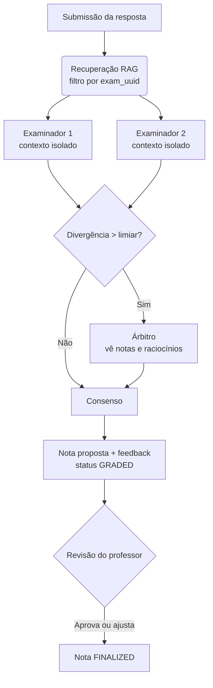

# AI Grading System (Multi-Agent)


Sistema multiagente para correção de provas discursivas. A parte interessante não é chamar um LLM para dar nota — é decidir **o que cada agente vê, quando um agente extra vale o custo, e onde o humano confirma antes de a nota valer**. Este README documenta essas decisões e o que a avaliação experimental mostrou, incluindo o que não funcionou.

Trabalho de Conclusão de Curso (TCC) submetido ao Bacharelado em Engenharia da Computação no Instituto Federal Fluminense, Campos dos Goytacazes-RJ, em abril de 2026.

**Autores:** Lucas Lorenzo Savino e Maycon Mendes Fernandes
**Orientador:** Prof. Dr. Luiz Gustavo Lourenço Moura
**Banca:** Prof. Dr. Fernando Luiz de Carvalho e Silva, Prof. Me. Márcio de Oliveira Pontes (IFF)

---

## O problema

Corrigir prova discursiva é caro e subjetivo. Um único avaliador — humano ou LLM — carrega viés e varia entre execuções. A resposta ingênua é "chama o modelo duas vezes e tira a média". A resposta de engenharia é desenhar quem vê o quê: o desenho aqui é inspirado no processo oficial de correção do ENEM, em que dois avaliadores corrigem de forma independente e um terceiro só entra quando as notas divergem além de um limiar.

## As decisões de contexto (e o porquê de cada uma)

### 1. Examinadores em contexto isolado

Dois agentes examinadores avaliam a mesma resposta em paralelo. Cada um recebe o enunciado, a rubrica, o material didático recuperado via RAG e a resposta do aluno — **e nada do outro examinador**: nem a nota, nem o raciocínio. No grafo LangGraph, cada nó de examinador escreve apenas o próprio campo de estado (`correction_1` ou `correction_2`), e o prompt do examinador não contém nenhuma referência ao outro avaliador.

**Por quê:** avaliadores que veem a nota um do outro ancoram. A independência é o que dá sentido à medida de divergência — se os contextos vazassem entre si, a concordância entre examinadores seria artefato, não sinal.

### 2. Árbitro invocado condicionalmente

Um terceiro agente árbitro existe no grafo, mas só é acionado quando `|nota_C1 − nota_C2|` ultrapassa um limiar configurável (`DIVERGENCE_THRESHOLD`, padrão 2.0). O roteamento é uma aresta condicional do LangGraph: sem divergência, o fluxo vai direto para o consenso.

**Por quê:** custo e economia de contexto. O árbitro é o agente mais caro do sistema — é o único que recebe, além de todo o material dos examinadores, as duas notas e as duas cadeias de raciocínio completas. Rodar isso em toda correção dobraria o contexto consumido para resolver um problema que só existe nos casos divergentes. O prompt do árbitro ainda o instrui a formar avaliação própria **antes** de ler as avaliações conflitantes, para reduzir ancoragem também nessa etapa.

### 3. RAG com escopo rígido por prova

A recuperação no ChromaDB filtra **sempre** por `exam_uuid`. Se a prova não tem material indexado, o sistema retorna contexto vazio em vez de fazer fallback global.

**Por quê:** vazamento de contexto entre provas contaminaria tanto a correção quanto o experimento (uma condição "sem RAG" que recebesse material de outra prova invalidaria a comparação pareada). Decidir o que **não** entra na janela de contexto é metade da engenharia de contexto.

### 4. Consenso que descarta outlier

Com duas notas, a final é a média simples. Com três (quando o árbitro é acionado), a final é a média das duas notas mais próximas — o outlier é descartado.

### 5. A nota só vale depois que um humano confirma

O pipeline automático deixa a resposta em status `GRADED`. Ela só vira `FINALIZED` quando o professor aprova ou ajusta a nota, com registro de quem aprovou e quando. A cadeia de raciocínio de cada agente é persistida, então toda nota é rastreável até o critério e o trecho de material que a justificou.

**Por quê:** o sistema propõe; o professor decide. Correção de prova tem consequência real para o aluno — é exatamente o tipo de decisão em que autonomia total do agente é a escolha errada.

### Fluxo de correção


```mermaid
graph TD
    A[Submissão da resposta] --> B(Recuperação RAG<br/>filtro por exam_uuid)
    B --> C1[Examinador 1<br/>contexto isolado]
    B --> C2[Examinador 2<br/>contexto isolado]
    C1 --> D{Divergência > limiar?}
    C2 --> D
    D -->|Sim| E[Árbitro<br/>vê notas e raciocínios]
    D -->|Não| F[Consenso]
    E --> F
    F --> G[Nota proposta + feedback<br/>status GRADED]
    G --> H{Revisão do professor}
    H -->|Aprova ou ajusta| I[Nota FINALIZED]
```

---

## Resultados validados (resumo do TCC)

A avaliação foi conduzida via estudo de caso controlado com dados pareados entre condições com e sem RAG, três questões discursivas de Algoritmos e Estrutura de Dados e quatro níveis de qualidade de resposta.

- **Completude estrutural:** 100 por cento no fluxo end-to-end. O sistema completou sem falhas.
- **Mecanismo de divergência:** das 24 correções avaliadas, nenhuma ultrapassou o limiar de 2.0 pontos (máximo observado: 1.22). **O árbitro condicional não foi acionado durante o experimento.** O caminho de arbitragem existe e está implementado, mas não foi exercitado com dados reais — é um resultado honesto, não um detalhe a esconder: significa que a concordância entre examinadores isolados foi maior do que o limiar assumia, e que o limiar em si precisa de calibração empírica.
- **Efeito do RAG na especificidade avaliativa:**
  - Nível intermediário: Δ = +0.84
  - Nível fraco: Δ = +0.12
  - Níveis extremos: Δ = 0.00
  - Leitura: o material recuperado ajuda onde há ambiguidade real. Nos extremos (resposta muito boa ou em branco), a rubrica sozinha basta e o contexto extra não muda nada.
- **Estabilidade (teste com R = 3 repetições):**
  - Níveis extremos: variação nula
  - Nível intermediário: critério atendido (≤ 1.0 ponto)
  - Nível fraco: **variação máxima de 1.37, ultrapassando o limiar de estabilidade.** Respostas fracas — vagas, parcialmente erradas — são onde o julgamento do modelo mais oscila entre execuções.

---

## Arquitetura

| Camada | Tecnologia |
|---|---|
| Orquestração de agentes | LangGraph + LangChain |
| Backend API | FastAPI |
| Banco de dados relacional | PostgreSQL |
| Vector store | ChromaDB |

LLM provider e embeddings são configuráveis via variáveis de ambiente. Cada agente usa saída estruturada (`with_structured_output` com schema Pydantic): uma chamada de LLM por avaliação, sem etapas intermediárias de parse.

---

## Instalação

### Pré-requisitos

- Python 3.12 ou superior
- PostgreSQL
- Docker e Docker Compose (opcional, recomendado para reprodutibilidade local)

### Setup com Docker (recomendado)

```bash
git clone https://github.com/savinoo/ai-grading-system.git
cd ai-grading-system

cp database.env.example database.env
cp .env.example .env

docker compose up -d
docker compose exec backend alembic upgrade head
```

A API estará disponível em `http://localhost:8000` e a documentação Swagger em `/docs`.

### Setup local sem Docker

```bash
python -m venv .venv
source .venv/bin/activate
pip install -r requirements.txt
alembic upgrade head
uvicorn src.main.server.server:app --reload --port 8000
```

### Variáveis principais

Configure em `.env`:

- `DATABASE_URL` — conexão PostgreSQL
- `SECRET_KEY` — chave para assinatura JWT
- `EMBEDDING_PROVIDER` — `google`, `openai` ou `local` (Ollama)
- `EMBEDDING_MODEL` — override opcional do modelo de embedding
- `DIVERGENCE_THRESHOLD` — limiar de acionamento do árbitro (padrão: 2.0)
- `RAG_TOP_K` — número de trechos recuperados por correção (padrão: 4)
- Chave de API do LLM provider escolhido

Veja `.env.example` para a lista completa de variáveis.

---

## Limitações honestas

- A avaliação usou respostas sintéticas em quatro níveis de qualidade sobre Algoritmos e Estrutura de Dados — não dados reais de turma.
- O árbitro nunca foi acionado no experimento; o caminho de arbitragem está implementado mas não validado com divergências reais.
- O nível fraco falhou no critério de estabilidade (variação de 1.37 contra limiar de 1.0).
- Os dois examinadores usam o mesmo modelo. O isolamento de contexto elimina a ancoragem entre eles, mas não o viés compartilhado do modelo: os dois podem errar juntos, na mesma direção, e o mecanismo de divergência não detecta isso.
- É um protótipo de pesquisa validado em escopo controlado, não um produto pronto para deployment institucional.

## O que eu faria diferente

- **Calibraria o limiar com dados, não por suposição.** O limiar de 2.0 veio de uma escolha a priori, e o experimento mostrou que a divergência real máxima foi 1.22 — o árbitro virou código morto no estudo. Hoje eu rodaria um piloto sem árbitro só para medir a distribuição de divergências e fixaria o limiar num percentil dela.
- **Diversificaria os examinadores de verdade.** Isolar contexto trata a ancoragem, mas dois examinadores idênticos concordam também nos erros. Modelos diferentes (ou no mínimo temperaturas/prompts distintos) tornariam a concordância um sinal mais forte. O trade-off é custo de manutenção de dois provedores e a perda da comparabilidade direta entre C1 e C2.
- **Mediria divergência por critério, não pela nota total.** Duas correções podem ter a mesma nota total discordando em todos os critérios, com os erros se compensando. Divergência por critério acionaria o árbitro nos casos certos — ao custo de mais acionamentos e mais contexto consumido.
- **Repensaria o papel do árbitro no consenso.** A regra "média dos dois mais próximos" pode descartar justamente a nota do árbitro se ela for o outlier — o que contradiz tê-lo chamado como revisor sênior. Uma alternativa é o veredito do árbitro prevalecer, aceitando o risco de um ponto único de falha na etapa mais cara.
- **Atacaria a instabilidade do nível fraco no prompt e na recuperação.** A query de RAG usa só o enunciado da questão; incluir a resposta do aluno recuperaria material mais relevante justamente para respostas vagas, onde o modelo mais oscila.

---

## Licença

MIT — ver arquivo `LICENSE`.
