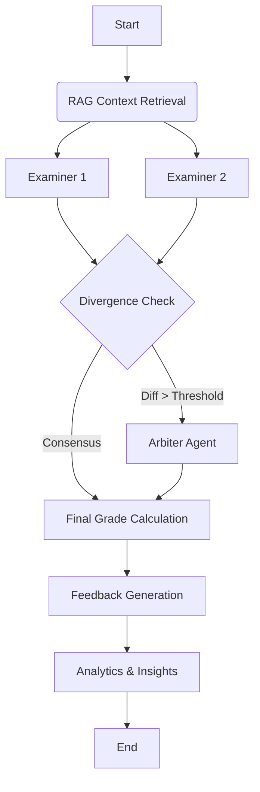

# 🎓 AI Grading System (Multi-Agent)


An autonomous, multi-agent system designed to automate the grading of complex academic essay questions with human-level reasoning and pedagogical feedback. Developed as a Capstone Project (TCC) in Computer Engineering.

---

## 🧠 Core Architecture

This system leverages a **Multi-Agent Workflow** orchestrated by **LangGraph** and optimized with **DSPy** for robust prompt engineering.

### The Agents
1.  **🔍 Examiner Agent (C1 & C2):** Two independent instances that grade student submissions against a detailed rubric using RAG (Retrieval-Augmented Generation) for context.
2.  **⚖️ Arbiter Agent:** Activated only when C1 and C2 diverge significantly (e.g., score difference > 1.5). It reviews arguments from both and decides the final grade.
3.  **🧬 Analytics Engine:** Runs in parallel to detect semantic plagiarism and analyze student evolution trends across submissions.

### Workflow Diagram


## 🚀 Key Features

*   **Massive Parallel Processing:** Optimized to handle batch corrections without hitting LLM Rate Limits (using Tenacity + Chunking).
*   **Cost-Efficient Intelligence:** Uses a tiered model strategy (Gemini 2.0 Flash for volume, Pro for complex arbitration).
*   **Resilience:** Self-healing logic for API errors and JSON formatting hallucinations.
*   **Pedagogical Feedback:** Generates constructive comments explaining *why* a grade was given.

## 🛠️ Tech Stack

*   **Orchestration:** LangGraph
*   **Prompt Optimization:** DSPy (Stanford)
*   **LLM:** Google Gemini 2.0 Flash (via LiteLLM)
*   **Interface:** Streamlit
*   **Vector DB:** ChromaDB (for RAG)

## 📦 Installation & Setup

1.  **Clone the repo:**
    ```bash
    git clone https://github.com/savinoo/ai-grading-system.git
    cd ai-grading-system
    ```

2.  **Install dependencies:**
    ```bash
    pip install -r requirements.txt
    ```

3.  **Configure Environment:**
    Create a `.env` file:
    ```env
    GOOGLE_API_KEY=your_api_key_here
    MODEL_NAME=gemini-2.0-flash
    ```

4.  **Run the App:**
    ```bash
    streamlit run app/main.py
    ```

---

**Authors:** Lucas Lorenzo Savino & Maycon Mendes
**License:** MIT
