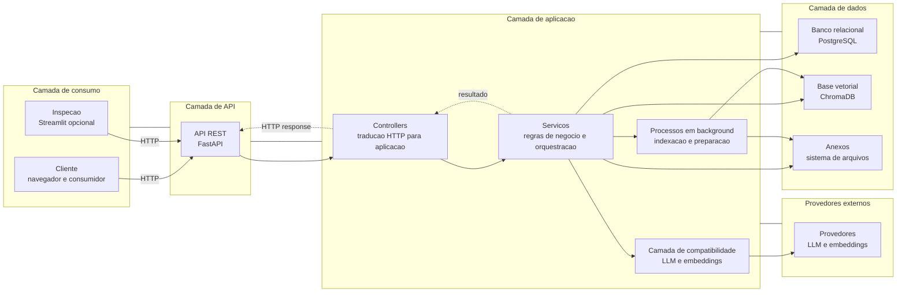

# Arquitetura do sistema (Mermaid)

```mermaid
flowchart LR
  %% Observacao: evitar parenteses nos labels para compatibilidade com renderizadores.

  subgraph Consumo[Camada de consumo]
    Client[Cliente<br/>navegador e consumidor]
    Inspect[Inspecao<br/>Streamlit opcional]
  end

  subgraph API[Camada de API]
    FastAPI[API REST<br/>FastAPI]
  end

  subgraph App[Camada de aplicacao]
    Controllers[Controllers<br/>traducao HTTP para aplicacao]
    Services[Servicos<br/>regras de negocio e orquestracao]
    Compat[Camada de compatibilidade<br/>LLM e embeddings]
    BG[Processos em background<br/>indexacao e preparacao]
  end

  subgraph Dados[Camada de dados]
    PG[Banco relacional<br/>PostgreSQL]
    Vec[Base vetorial<br/>ChromaDB]
    Files[Anexos<br/>sistema de arquivos]
  end

  subgraph IA[Provedores externos]
    Providers[Provedores<br/>LLM e embeddings]
  end

  %% Fluxos principais
  Client -->|HTTP| FastAPI
  Inspect -->|HTTP| FastAPI
  FastAPI --> Controllers --> Services

  Services -.->|resultado| Controllers -.->|HTTP response| FastAPI

  Services --> PG
  Services --> Vec
  Services --> Files

  Services --> Compat --> Providers

  Services --> BG
  BG --> Vec
  BG --> Files

  %% Ajustes de layout
  Consumo --- API
  API --- App
  App --- Dados
  App --- IA
```
