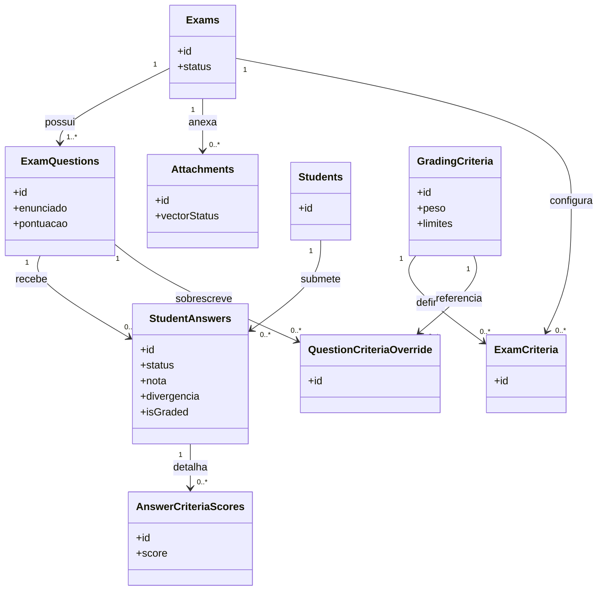

# Modelo ER simplificado (Mermaid)

```mermaid
classDiagram
  %% Observacao: evitar parenteses nos labels para compatibilidade com renderizadores.

  class Exams {
    +id
    +status
  }

  class ExamQuestions {
    +id
    +enunciado
    +pontuacao
  }

  class Attachments {
    +id
    +vectorStatus
  }

  class Students {
    +id
  }

  class StudentAnswers {
    +id
    +status
    +nota
    +divergencia
    +isGraded
  }

  class AnswerCriteriaScores {
    +id
    +score
  }

  class GradingCriteria {
    +id
    +peso
    +limites
  }

  class ExamCriteria {
    +id
  }

  class QuestionCriteriaOverride {
    +id
  }

  %% Relacionamentos e cardinalidades
  Exams "1" --> "1..*" ExamQuestions : possui
  Exams "1" --> "0..*" Attachments : anexa

  ExamQuestions "1" --> "0..*" StudentAnswers : recebe
  Students "1" --> "0..*" StudentAnswers : submete

  StudentAnswers "1" --> "0..*" AnswerCriteriaScores : detalha

  GradingCriteria "1" --> "0..*" ExamCriteria : define
  Exams "1" --> "0..*" ExamCriteria : configura

  ExamQuestions "1" --> "0..*" QuestionCriteriaOverride : sobrescreve
  GradingCriteria "1" --> "0..*" QuestionCriteriaOverride : referencia
```
