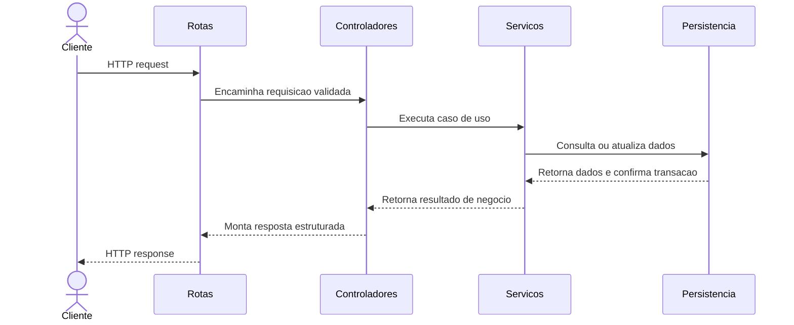

# Fluxo em camadas do backend - diagrama de sequencia

```mermaid
sequenceDiagram
  %% Observacao: evitar parenteses e acentos nos labels para compatibilidade com renderizadores.

  actor C as Cliente
  participant R as Rotas
  participant CTRL as Controladores
  participant S as Servicos
  participant P as Persistencia

  C->>R: HTTP request
  R->>CTRL: Encaminha requisicao validada
  CTRL->>S: Executa caso de uso

  S->>P: Consulta ou atualiza dados
  P-->>S: Retorna dados e confirma transacao

  S-->>CTRL: Retorna resultado de negocio
  CTRL-->>R: Monta resposta estruturada
  R-->>C: HTTP response
```
