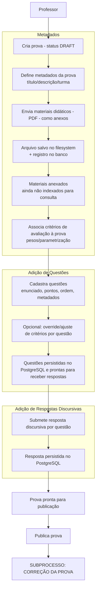
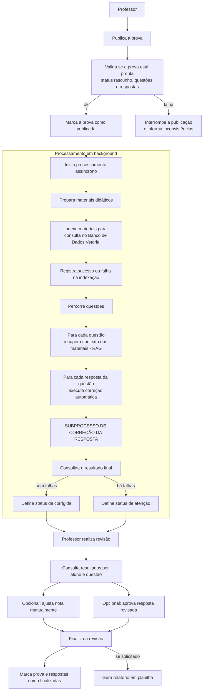
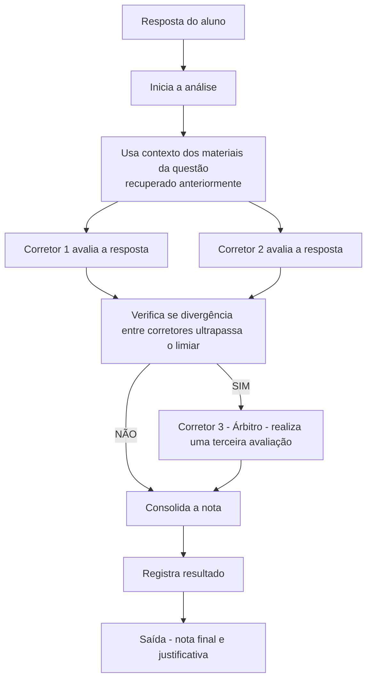

# Fluxogramas dos subprocessos (implementação atual)

Este documento descreve, em forma de fluxograma, **como os subprocessos acontecem hoje no projeto** (backend FastAPI + PostgreSQL + ChromaDB + LangGraph).

> Observação: o sistema executa a **correção automatizada** após a publicação da prova (processamento em background) e oferece **revisão docente** e **relatório Excel** em rotas específicas de revisão.

---

## 1) Subprocesso: Configuração da Prova

---

## 2) Subprocesso: Correção da Prova (publicação + background + revisão)

---

## 3) Subprocesso: Correção da Resposta (workflow LangGraph)

---

## Notas de fidelidade (pontos que o diagrama respeita)

- A publicação só ocorre quando a prova está em rascunho e possui questões e respostas válidas.
- O processamento assíncrono prepara os materiais e executa a correção automática.
- A correção utiliza contexto recuperado dos materiais da própria prova, recuperado uma vez por questão e reutilizado nas respostas.
- O árbitro só é acionado quando há divergência relevante entre os dois primeiros corretores.
- A revisão docente permite ajustes e finalização, com opção de gerar relatório em planilha.
